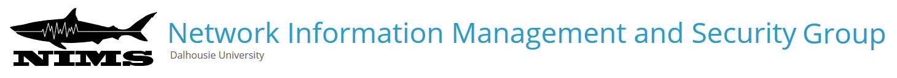

# TPG Community Information

A repository of working groups, code repositories, and research being done with TPG in the evolutionary computation research domain.

## Research Groups

**Lab Coordinator**: Malcolm Heywood

**Current Students**: Robert Smith

**Current Research**: Digital world navigation, transfer learning, video game applications

Website: [Link](https://web.cs.dal.ca/~mheywood/)

---

## Code Repositories
Pending

## Research Papers
Pending
